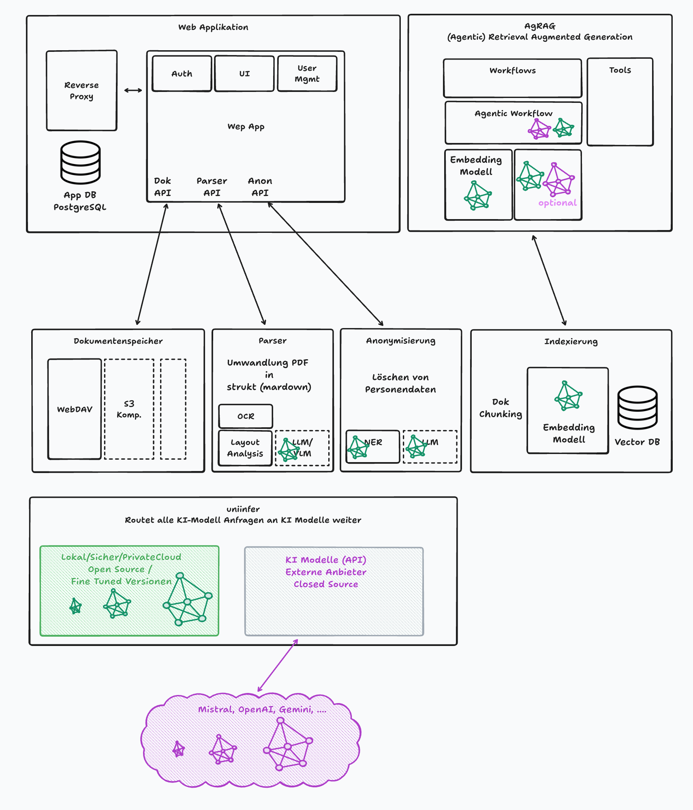

# System- und Hardwareanforderungen für die Vergabe-Applikation

version: 0.1
date: 2025-06-12
author: skale.dev

Dieses Dokument beschreibt die minimalen und empfohlenen System- und Hardwareanforderungen für den Betrieb der Vergabe-Applikation. Vorzugsweise wird bei vorhandensein gleichwertiger Lösungen Open Source Software verwendet. Bei der verwendung von KI Modellen wird vorzugsweise sofern sinnvoll Modelle eingesetzt die lokal oder in einer private Cloud Umgebung betrieben werden können, und wo die Möglichkeit einer Anpassung (Fine-Tuning) besteht.

## Projektanforderungen

Ein Ausschreibungsprojekt hat typisch folgende Anforderungen:
Eine Projekt besteht aus einem Datensatz der Ausschreibenden Stelle und mehreren Bieterdatensätzen von typ 200 Dokumenten mit insgesamt 2000 Seiten.

Typ Ausschreibung
Dokumente: 200
Seiten: 2000
Dokumentenart: PDF, Word, Excel, PowerPoint
Dokumentensatzgröße: 100 MB
Dokumentenqualität: hochwertig
Dokumentenaufbereitung: strukturierte Daten (markdown)

## Modul Web Applikation

Linux +

- Node.js, aktueller LTS Version
  npm/yarn/pnpm verfügbar
- PM2 - Node Prozess Manager
- App DB
  PostgreSQL, aktuelle Version
  für Nutzerdatenverwaltung, Logging, Audit Trails, Metadaten
  Min 100 MB
- Offene Ports (80, 443, ggf. 5432).
- NGINX Reverse Proxy
- SSH Zugang
- Firewall
- SSL Zertifikat
- Backups (Datenbank)
- Authentifizierung mit SAML2

Ausreichend RAM/CPU für erwartete Last, standard CPU.

Optional

- Docker
- CI/CD Integration
- Domain / DNS

Hardware Anforderung:

## Modul Dokumentenspeicher

### Unterstützte Datenquellen

- **WebDAV**: Unterstützung für WebDAV-kompatible Speichersysteme.
- **S3-kompatibel**: Geplant (To-Do) – Unterstützung für S3-kompatible Cloud-Speicherlösungen.
- **Weitere**: Auf Anfrage können zusätzliche Speicherintegrationen implementiert werden.

### Speicheranforderungen

- **Minimal**: 10 GB freier Speicherplatz.
- **Empfohlen**: 100 GB freier Speicherplatz für optimale Leistung und zukünftiges Wachstum.

## Strukturierte Datenaufbereitung (Parsing und Extraktion)

### Funktionalität

- **Meta Parser `pdf2md` (von skale.dev)**: Wandelt verschiedene Dokumenttypen (PDF, Bilder, Office-Dokumente) in Markdown um.

### Hardwareanforderungen für den lokalen Server

Minimale Konfiguration

- **CPU**: Standard-CPU (z.B. Intel Core i5 oder vergleichbar).
- **RAM**: 16 GB RAM.
- **Zweck**: Unterstützung für grundlegende Textverarbeitungstools wie `docling`, `marker`, `tesseract` und `easyocr`.
- Python Umgebung >= 3.12
- Alternative: Docker Container

Optionale/Empfohlene Konfiguration (für erweiterte KI-Funktionen)

- **CPU/GPU**: Leistungsstarke CPU oder dedizierte GPU (z.B. NVIDIA RTX 3060 oder besser).
- **RAM**: 20 GB RAM.
- **Zweck**: Beschleunigung der Datenaufbereitung für OLMO VLM (Vision-Language Models) und LLM (Large Language Models).

## Modul Anonymisierung

- **Entitätenerkennung**: Entfernung sensibler Informationen aus Dokumenten.

- Python Umgebung >= 3.12
- Alternative: Docker Container
- Mit NER Modell (Named Entity Recognition)
  - **CPU**: Standard-CPU.
  - **RAM**: 8 GB RAM.
- Optional mit LLM Modell (Large Language Model):
  - **GPU**: Dedizierte GPU mit mindestens 16 GB VRAM.

## Modul Indexierung

In der Indexierung werden die markdown dokumente in Segmente unterteilt. Diese Segmente werden mit einem Embedding Modell in einen Vektor umgewandelt und in eine Datenbank gespeichert. Überblick über Embedding Modelle: [Link](https://huggingface.co/spaces/mteb/leaderboard).

Schätzung: Projekt Dokumentensatz ca 100 MB an Index Datenbankspeicher.

System-Anforderungen:
Minimal: Qwen3-Embedding 0.6B: 2-4 GB GPU, 8-16 GB RAM.
Optional: BGE-M3: 4-8 GB GPU, 16-32 GB RAM.
Optional: E5-Mistral-7B: 32 GB GPU, 64 GB RAM.

- PostgreSQL-Version: Mindestens 14, besser 16+, mit pgvector (CREATE EXTENSION vector;).
- Speicherleistung: SSD mit >1000 IOPS für schnelle Abfragen.
- python >= 3.12
- Alternative: Docker Container

## Modul AgRAG - Agentic Retrieval Augmented Generation

Das RAG-Modul (Retrieval Augmented Generation) nutzt das Indexmodul, um relevante Textsegmente zu identifizieren, die mit einer spezifischen Aufgabe oder Fragestellung korrespondieren. Diese Textsegmente werden als "Kontext" zusammengefasst und dem KI-Modell als Wissensbasis bereitgestellt. Durch diesen gezielt ausgewählten Kontext wird das KI-Modell befähigt, präzise und faktenbasierte Antworten zu generieren sowie komplexe Aufgaben effektiv zu bearbeiten.

In den (Agentic) Workflows sind die Aufgaben abgebildet die mit Agents oder RAG gelöst werden.

- Erstelle eine Kriterienliste auf Basis der Ausschreibungsdaten
- Überprüfe Kriterium 1 der Ausschreibung A.
- Erstelle einen Prüfreport für die Ausschreibung A.

- Optionale Erweiterungen
  - Agentic Memory (Mem0)

Systemanforderungen

- python >= 3.12
- Alternative: Docker Container
- KI Modell (via uniinfer)
- Embedding Modell (via uniinfer)

## Modul uniinfer

universal inference (uniinfer) verteilt KI Modellanfragen auf lokale und remote KI Modelle. Zur Abschätzung des GPU VRAM Ressourcenbedarfs: [vrammer](https://vrammer-skaleios-projects.vercel.app/).

- python >= 3.12
- vLLM - LLM Server
- Alternative: Docker Container
